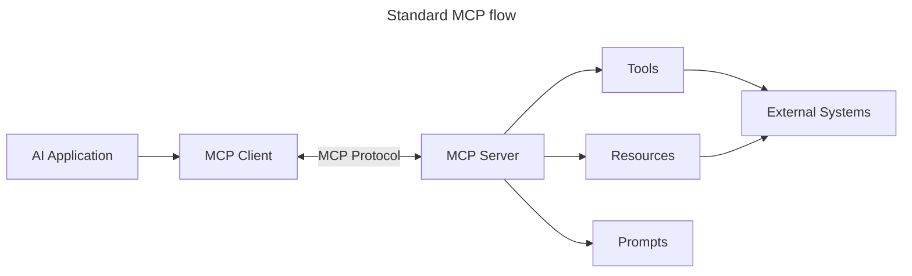
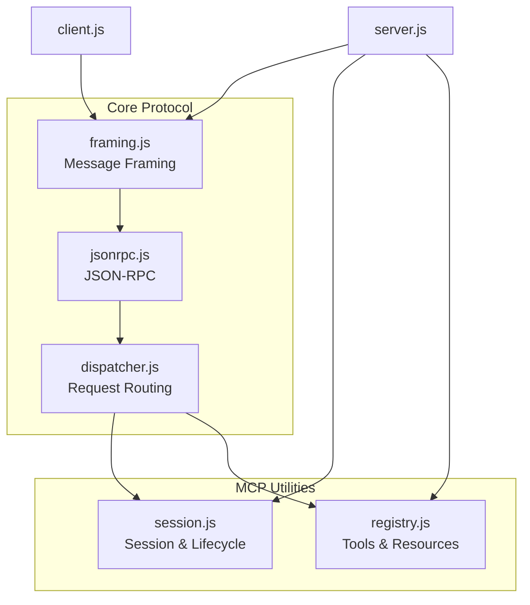

# **Building MCP From Scratch**

Most MCP tutorials start with an SDK: install a package, define a tool, connect it to a client, and you're done.

That's useful when the goal is simply to build an MCP server quickly.

But I wanted to understand something different:

### What actually happens underneath the SDK?**

How does an MCP client discover available tools?  
How are requests structured?  
How does the server decide which tool to execute?  
How are parameters passed and validated?  
How are errors handled?  
And ultimately, what does it really take to implement MCP yourself?

So I decided to build an MCP server **from scratch**, without relying on an MCP SDK.

The goal of this repository is not to build the most feature-complete MCP implementation. The goal is to understand the protocol itself by implementing its core concepts piece by piece.

Along the way, this project explores MCP, JSON-RPC, client-server communication, tool discovery, request dispatching, parameter validation, error handling, and the overall lifecycle of an MCP connection.

> **This is a learning project focused on understanding how MCP works under the hood.**

---

### **MCP Features Covered in This Implementation**

This project does not attempt to implement the entire MCP specification.

The implementation is intentionally incremental, with the goal of understanding the protocol by building its core concepts from scratch.

Currently implemented:

- **Tools** – Expose executable functions that the MCP client can discover and invoke.
- **Resources** – Expose data that can be accessed through the MCP server.

Still to be implemented:

- **Prompts** – Support for predefined prompt templates and workflows.
- **Notifications** – Support for one-way messages that do not require a response.

The implementation will continue to evolve as more parts of the MCP protocol are explored.

---

## **What is MCP?**

MCP stands for **Model Context Protocol**.

At a high level, MCP is a protocol that allows AI applications to communicate with external tools, data sources, and services in a standardized way.

Without MCP, an AI application that wants to interact with different external systems would need custom integrations for each one.

For example, an AI application might need to:

- Read files from a filesystem
- Query a database
- Call an external API
- Search documentation
- Execute a specific operation
- Access application-specific data


---

## **High-Level MCP Architecture Overview**

MCP follows a **client-server model**, where:

- **MCP Hosts** run the AI models
- **MCP Clients** initiate requests
- **MCP Servers** serve context, tools, and capabilities

### Key Components:

- **Resources** – Static or dynamic data for models  
- **Prompts** – Predefined workflows for guided generation  
- **Tools** – Executable functions like search, calculations  
- **Sampling** – Agentic behavior via recursive interactions (deprecated in `2026-07-28` release candidate)
- **Elicitation** – Server-initiated requests for user input
- **Roots** – Filesystem boundaries for server access control (deprecated in `2026-07-28` release candidate)

### Protocol Architecture:

MCP uses a two-layer architecture:
- **Data Layer**: JSON-RPC 2.0 based communication with lifecycle management and primitives
- **Transport Layer**: STDIO (local) and Streamable HTTP with SSE (remote) communication channels

---

## **How MCP Servers Work**

MCP servers operate in the following way:

- **Request Flow**:
    1. A request is initiated by an end user or software acting on their behalf.
    2. The **MCP Client** sends the request to an **MCP Host**, which manages the AI Model runtime.
    3. The **AI Model** receives the user prompt and may request access to external tools or data via one or more tool calls.
    4. The **MCP Host**, not the model directly, communicates with the appropriate **MCP Server(s)** using the standardized protocol.
- **MCP Host Functionality**:
    - **Tool Registry**: Maintains a catalog of available tools and their capabilities.
    - **Authentication**: Verifies permissions for tool access.
    - **Request Handler**: Processes incoming tool requests from the model.
    - **Response Formatter**: Structures tool outputs in a format the model can understand.
- **MCP Server Execution**:
    - The **MCP Host** routes tool calls to one or more **MCP Servers**, each exposing specialized functions (e.g., search, calculations, database queries).
    - The **MCP Servers** perform their respective operations and return results to the **MCP Host** in a consistent format.
    - The **MCP Host** formats and relays these results to the **AI Model**.
- **Response Completion**:
    - The **AI Model** incorporates the tool outputs into a final response.
    - The **MCP Host** sends this response back to the **MCP Client**, which delivers it to the end user or calling software.
    


---


## Project Structure

The project is intentionally split into small modules.

Instead of putting the entire MCP implementation inside a single server file, each responsibility is isolated so that the protocol can be understood and implemented piece by piece.

```text
mcp-from-scratch/
│
├── src/
│   │
│   ├── core/
│   │   ├── dispatcher.js
│   │   ├── framing.js
│   │   └── jsonrpc.js
│   │
│   ├── util/
│   │   ├── registry.js
│   │   └── session.js
│   │
│   ├── client.js
│   └── server.js
│
├── package.json
├── README.md
└── .gitignore
```

- **`src/core/dispatcher.js`**
  Handles request routing and maps incoming JSON-RPC methods to their registered handlers.  
  It is responsible for executing the appropriate handler and returning the result.

- **`src/core/framing.js`**  
  Handles message framing over the transport stream.  
  It reads incoming data, buffers it, and extracts complete messages for processing.

- **`src/core/jsonrpc.js`**  
  Implements the JSON-RPC 2.0 message layer.  
  Handles requests, responses, notifications, and JSON-RPC errors.

- **`src/util/registry.js`**  
  Manages the MCP capabilities registered with the server.  
  Currently contains registries for **Tools** and **Resources**.

- **`src/util/session.js`**  
  Manages the MCP session and its lifecycle.  
  Handles initialization, protocol information, capabilities, and session state.

- **`src/server.js`**  
  The main MCP server entry point that brings all the components together.  
  It registers tools/resources, handles incoming requests, and communicates over STDIO.

- **`src/client.js`**  
  A lightweight MCP client used to interact with and test the server.  
  It demonstrates initialization, capability discovery, tool calls, and resource operations.




---


## **What I Learned**

Building MCP from scratch gave me a much better understanding of what happens behind an MCP SDK.

Instead of treating MCP as a black box, this project helped me understand the individual pieces involved:

- How MCP client-server communication works
- How JSON-RPC messages are structured and processed
- How messages are framed over STDIO
- How requests are dispatched to handlers
- How MCP sessions and lifecycle are managed
- How tools and resources are registered and exposed
- How parameters are validated
- How errors are handled

The biggest takeaway was that an MCP server is not just about defining tools.

There is a protocol underneath that handles communication, lifecycle, discovery, routing, and execution and implementing those pieces myself made the overall architecture much easier to understand.

---

## What's Next?

This project is intentionally being built incrementally.

The next things I plan to explore are:

- [ ] Implement Prompts
- [ ] Implement Notifications
- [ ] Explore additional MCP capabilities
- [ ] Improve test coverage
- [ ] Explore additional transports
- [ ] Experiment with the implementation using different MCP clients

This repository will evolve as I continue exploring the protocol.

> **The goal was never to build MCP perfectly. The goal was to understand it by building it.**
